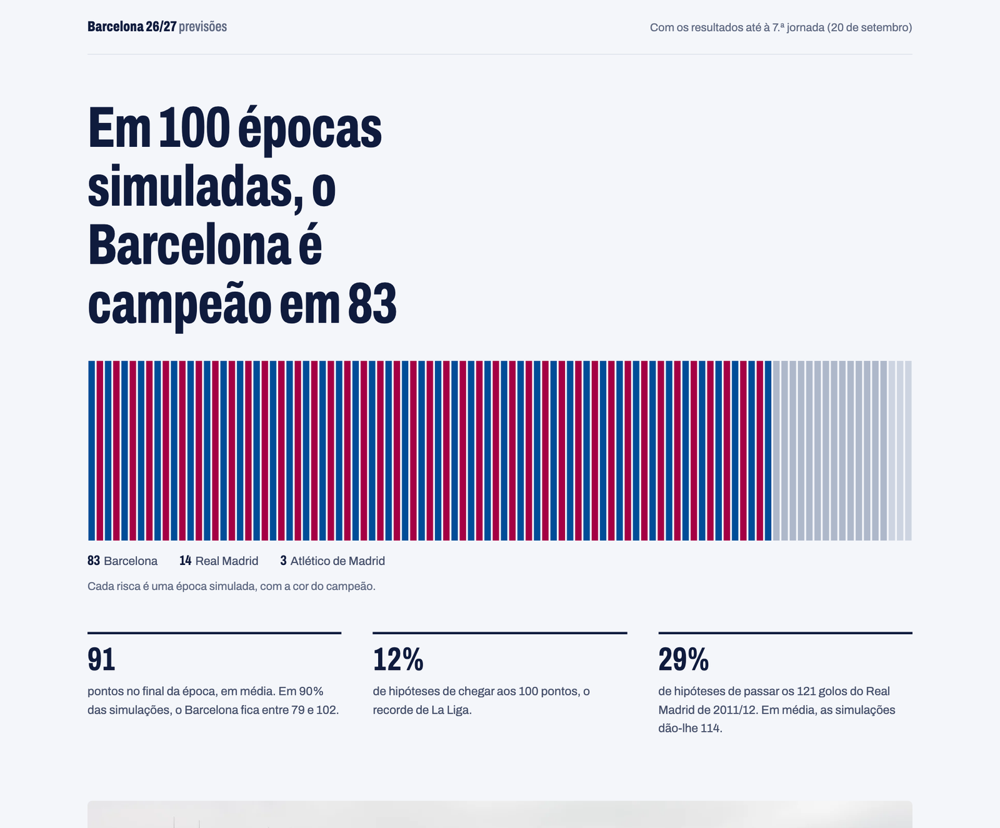

# Barcelona 26/27: previsões para La Liga

Modelo estatístico que estima como vai acabar a época 2026/27 do Barcelona em La Liga e prevê os jogos de cada jornada antes de se disputarem. O site atualiza-se sozinho todos os dias.

Site: https://lpseco11.github.io/barca-season-predictor/



## O que o projeto faz

Depois de cada jornada, um modelo Dixon-Coles volta a estimar a força de ataque e de defesa das 20 equipas, e o resto da época é simulado 10 000 vezes. Daí saem as hipóteses de título, de Champions e de descida de cada equipa, e os pontos com que deve acabar.

Antes de cada jornada, o projeto regista a previsão de cada jogo: probabilidades de vitória, empate e derrota e o resultado mais provável. O ficheiro fica no repositório com a data do commit, por isso dá para confirmar que a previsão foi feita antes do jogo.

O site também compara os golos do Barcelona com o xG de cada jogo, para perceber se as goleadas vêm de criar muitas ocasiões ou de uma eficácia fora do normal.

## Resultados do backtest

Antes de ser usado nesta época, o modelo previu as épocas 2023/24, 2024/25 e 2025/26 de La Liga (1140 jogos), semana a semana, só com os jogos já disputados em cada momento.

| | RPS | Log loss | Acerto 1X2 |
|---|---|---|---|
| Palpite ingénuo (frequências médias) | 0,225 | 1,064 | 45,8% |
| Este modelo | 0,194 | 0,970 | 52,9% |
| Casas de apostas (odds médias) | 0,189 | 0,956 | 55,0% |

O RPS (Ranked Probability Score) é a métrica habitual para avaliar previsões de futebol; quanto mais baixo, melhor. O modelo recupera cerca de 86% da distância entre o palpite ingénuo e as casas de apostas, com resultados parecidos nas três épocas.

O modelo é conservador com os favoritos. Quando dá 75% a uma equipa, ela ganha cerca de 82% das vezes. Nos jogos do Barcelona previa vitória em 63% dos casos, e o Barcelona ganhou 75%.

## Como funciona

1. Dados: resultados, remates, xG e odds de La Liga e da Segunda Divisão desde 2021/22, de [football-data.co.uk](https://www.football-data.co.uk/). A Segunda serve para as equipas promovidas terem histórico.
2. Modelo: Dixon-Coles com decaimento temporal. Cada jogo pesa `exp(-ξ · dias)`, com ξ = 0,0019, o melhor valor no backtest; um jogo com um ano conta metade. Os parâmetros são estimados por máxima verosimilhança, com gradiente analítico.
3. Simulação: Monte Carlo das jornadas em falta. Em cada simulação, as forças das equipas são sorteadas a partir da incerteza da estimativa (aproximação de Laplace). Depois da 7.ª jornada, isso baixou a probabilidade de título do Barcelona de 88% para 83%.
4. Atualização: um workflow do GitHub Actions corre todas as manhãs. Regista previsões para jogos novos, volta a simular a época quando há resultados novos e gera o site estático em `docs/`, publicado pelo GitHub Pages. Só faz commit quando alguma coisa mudou.

## Limitações

O modelo só vê resultados. Não sabe de lesões, castigos, onzes iniciais ou trocas de treinador, e é sobretudo por isso que fica atrás das casas de apostas.

Dentro de cada época simulada, a força de cada equipa fica fixa. Na classificação, os empates em pontos são desfeitos pela diferença de golos, enquanto La Liga usa primeiro o confronto direto.

O xG só aparece nos dados a partir de 2026/27, por isso o modelo é treinado com golos.

## Estrutura

```
src/barca/      data, model (Dixon-Coles), backtest, simulate, predict
scripts/        predict_matchday, simulate_season, build_site, evaluate_predictions, run_backtest
site/           template da página e lista de emblemas
docs/           site gerado, publicado pelo GitHub Pages
predictions/    previsões registadas antes de cada jornada e histórico da época
tests/
.github/        workflow diário
```

## Correr localmente

Requer Python 3.11 ou mais recente.

```bash
python3 -m venv .venv
.venv/bin/pip install -r requirements.txt
.venv/bin/pip install -e .
.venv/bin/pytest

.venv/bin/python scripts/predict_matchday.py   # previsões dos próximos jogos
.venv/bin/python scripts/simulate_season.py    # simulação da época
.venv/bin/python scripts/build_site.py         # gera docs/index.html
```

## Créditos

Dados de [football-data.co.uk](https://www.football-data.co.uk/). Fotografia do Camp Nou de Luis Miguel Bugallo Sánchez, CC BY-SA 3.0. Os emblemas são marcas dos respetivos clubes e aparecem só para identificar as equipas; a origem de cada imagem está em [docs/img/CREDITS.md](docs/img/CREDITS.md).
